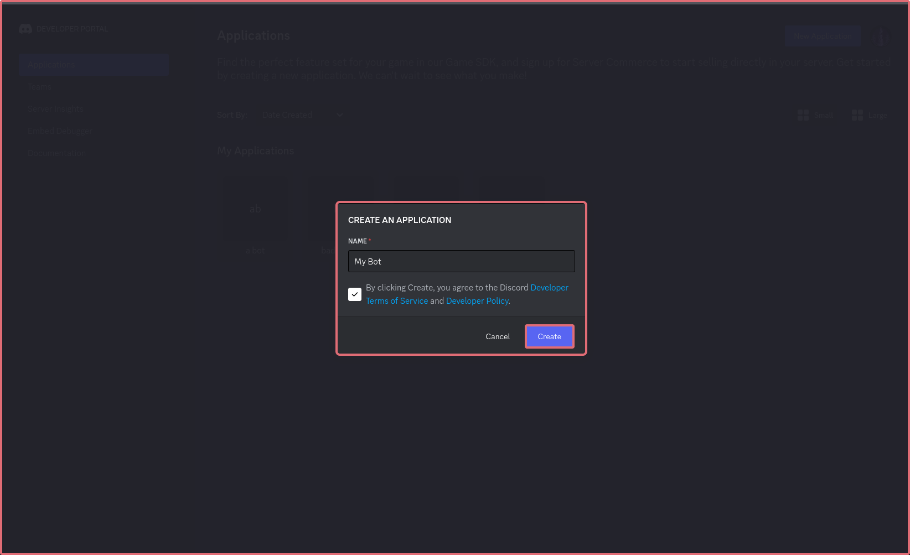
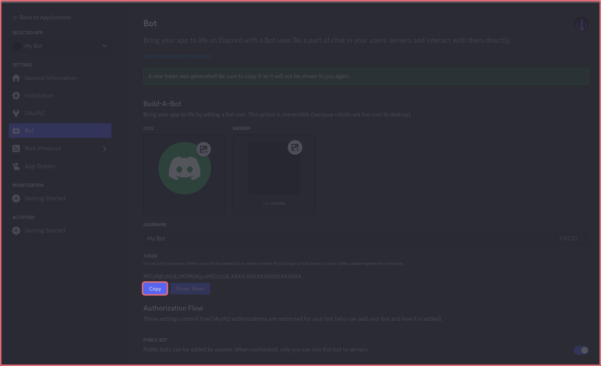
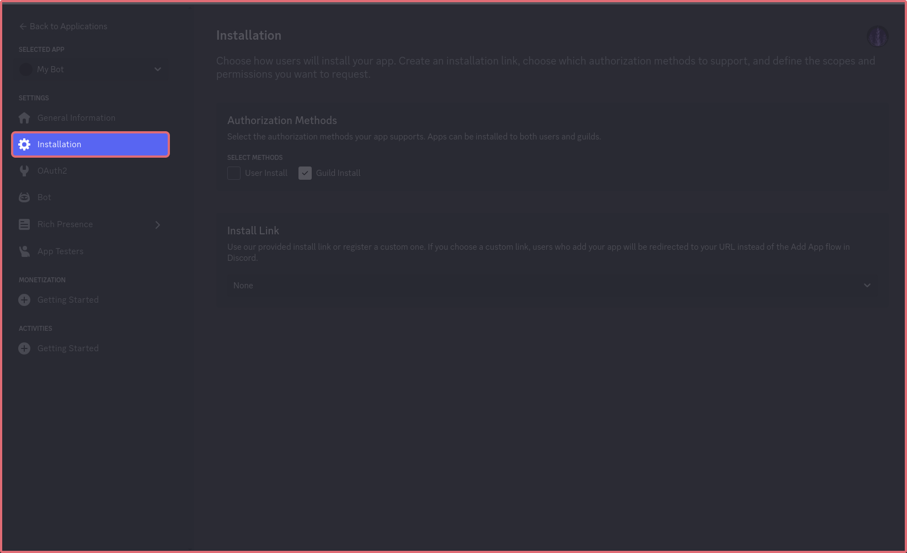
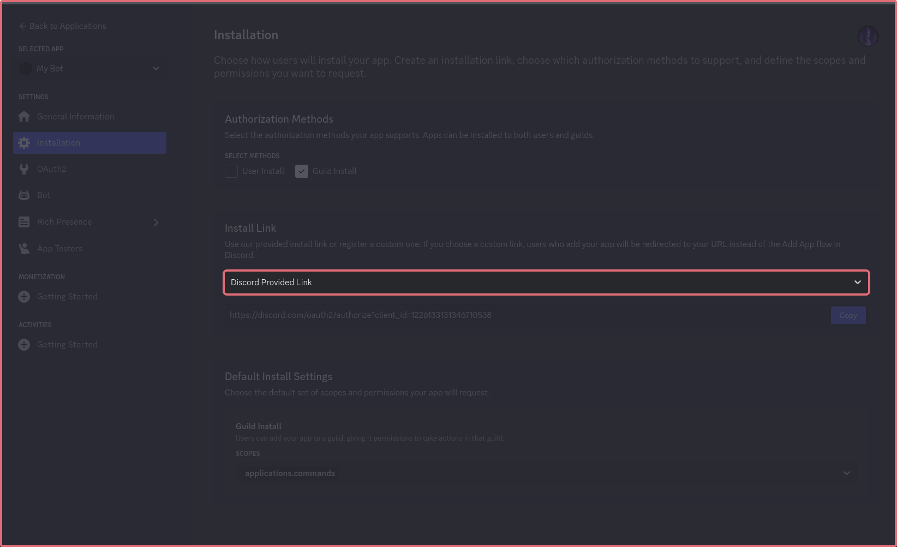
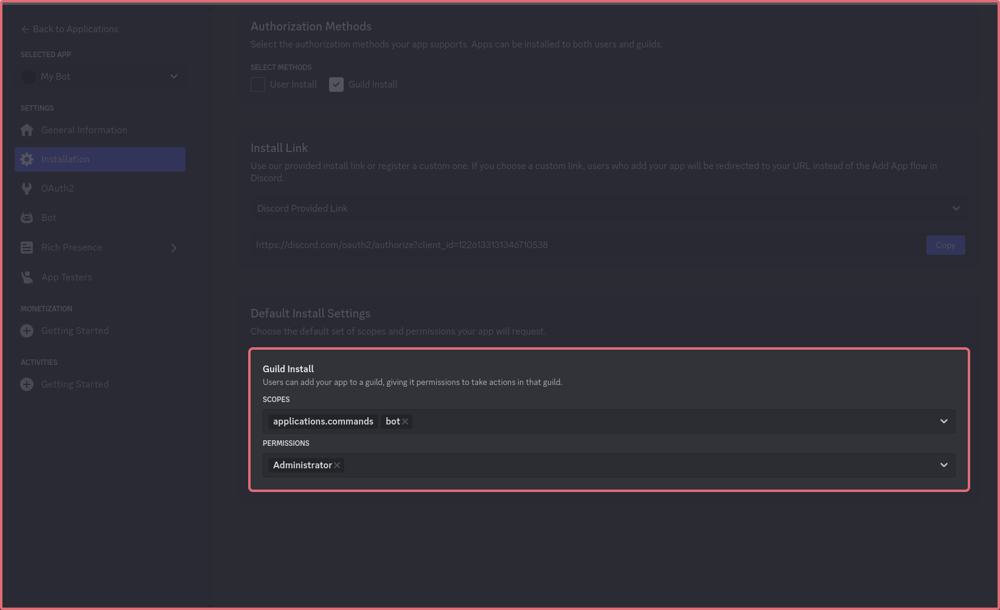
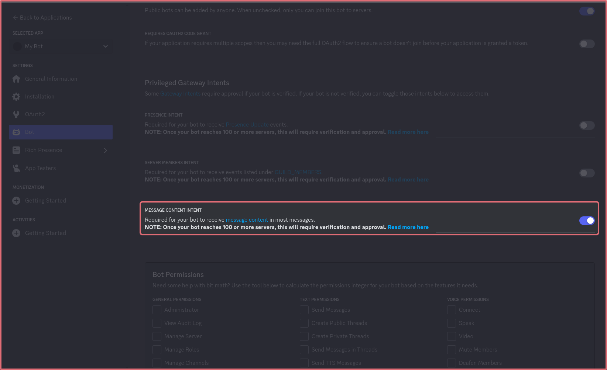

# create your first project

## Install Dependencies



```bash
npm init -y

npm i @splitscript.js/discord dotenv
npm i -g @splitscript.js/core@latest

npm i --save-dev @types/node
```



```bash
pnpm init

pnpm i @splitscript.js/discord dotenv
pnpm i -g @splitscript.js/core@latest

pnpm i --save-dev @types/node
```



```bash
bun init

bun i @splitscript.js/discord dotenv
bun i -g @splitscript.js/core@latest

bun i --save-dev @types/node
```



## Connect to Discord

### Creating a bot

Go to [https://discord.com/developers/applications](https://discord.com/developers/applications)

<details>

<summary>Create a bot</summary>




.png>)



</details>

<details>

<summary>Invite your bot</summary>







Open the install link

</details>

### Create an env file


```
DISCORD_BOT_TOKEN=XXXX
```


### Import environment variables

In your editor of choice, create a app.ts file


```typescript
import 'dotenv/config'
```


### Start listening


```typescript
import discord from "@splitscript.js/discord";

discord.listen(process.env.DISCORD_BOT_TOKEN as string, {
    intents: []
})
```


### Get your bot online

You can now start the bot, by running

This command also provides boilerplate for listeners and automatic restarts when you save a file

```bash
splitscript dev app.ts
```

### Run code on start

You can run a function after the bot starts, by using the `ready` event


```typescript
import { Events } from '@splitscript.js/discord';
export default async function (event: Events.Ready) {
    console.log(`Logged in as ${event.user.username}#${event.user.discriminator}`)
}
```


After saving this, look at your terminal. It should show the above message

### Add a message (prefix) command

<details>

<summary>Enable Message Content Intent</summary>



</details>

We need to set the intent in our code to be able to read messages


```typescript
discord.listen(process.env.DISCORD_BOT_TOKEN as string, {
    intents: ["message_content", "guild_messages"]
})
```


Next, lets handle the command. We'll use the discord/message/create event


```typescript
import { Events, messages } from '@splitscript.js/discord'

export default async function (event: Events.MessageCreate) {
    // Check if the message starts with !ping, and exit if it doesn't
    if (!event.content.startsWith("!ping")) return

    // Send a message back
    await messages.create(event.channelId, {
        content: "Pong!"
    })
}
```


Now, when you send a message starting with !ping, our bot responds with Pong!

### Slash Commands


This section requires the applications.commands scope


#### Register the Command

Before we can handle commands, we need to register it first. Lets do this automatically in our  functions/discord/ready folder.


```typescript
import { Events, commands } from '@splitscript.js/discord';
export default async function (event: Events.Ready) {
    await commands.create({name: "ping", description: "pong"})
}
```


It may take a few minutes for the command to appear

#### Handle the Command


```typescript
import { Events, responses } from '@splitscript.js/discord';
import { CallbackMessageType } from '@splitscript.js/discord/responses';

export default async function (event: Events.InteractionCreate) {
    // If its not the ping command, return
    if (event.data?.name !== 'ping') return

    // Reply to the command
    await responses.create(event.id, event.token, {
        type: CallbackMessageType.Reply,
        data: {
            content: 'Pong!'
        }
    })
}
```


After runnning /ping, our bot should reply with Pong!
